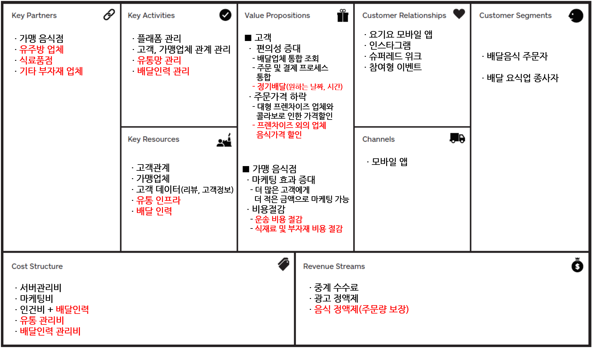

# 요기요 유통 비즈니스 모델 데이터 분석

###  
## 목차
* 개요
* 비지니스 문제 정의
* 데이터 분석 문제 정의
* 데이터 분석
  - 데이터 셋 확인
  - 데이터 전처리
  - 데이터 시각화
  - EDA
  - 통계분석
  - 데이터 마이닝
 * 결론
 * 출처

###  
## 개요

2018년 배달관련 기사를 찾아보다가 주방의 종말(Is the Kitchen Dead?)이란 포스트를 보았다.
제목이 되게 특이하다 주방의 종말...
이 포스터의 내용을 간단히 요약하자면 이렇다.  

음식을 요리해서 먹는 문화는 3가지 측면에서 배달해 먹는 문화로 바뀔것이다.
1. 낮아지고 있는 식사 생산 비용
2. 확대되고 있는 물류 규모
3. 인구통계학적인 트렌드

밀레니얼 세대인 나는 실제로 요리하는 것은 비효율적인 일이라고 생각한다. 요리하는 시간뿐만 아니라 치우는 시간, 설겆이하는 시간, 요리를 위한 주방, 도구 들이 너무나 아깝다. 그렇기 때문에 이런 일을 전문적으로 하는 음식점이 당연히 있어야 하고, 음식은 당연히 사먹고, 시켜먹는 문화가 될 것이란게 나의 생각이며 바램이다.

우리의 아버지세대(58년 개띠, 베이비붐)는 좀 달랐다. 주변에 음식점이라는 개념이 별로 자리잡지 않았기 때문에 어머니는 요리를 하셔야 했고, 행사나 잔치때면 집에서 모든것을 해결했기 때문에 많은 그릇과 조리기구들이 필요했다. 하지만 이제 시대가 달라졌다. 음식점들이 많아졌고(특히 우리나라는 더 많아졌다.) 다양한 종류의 음식들이 나오고 있다. 그리고 더 싸고, 질도 좋아지고 있다.

이러한 문화의 변화가 이루어지고 빨라지기 위해선 어떻게 해야 될까?
내가 내린 결론은 2가지 였다.
__1. 유통비용 하락__
__2. 음식 원가 및 부자재 비용 하락__

이 두 가지를 이룬다면 자연스럽게 음식은 사먹고, 배달해 먹는 문화가 만들어 질 것이다.

이 2가지 결론을 바탕으로 요기요에서 할 수 있는 비즈니스 모델을 만들어보았다. 이 비즈니스 모델을 바탕으로 데이터 분석을 통하여 가능한지 확인해보는 것이 이번 프로젝트의 목표이다.

이제 의문문 제목의 레포트가 아닌 평서문 제목의 레포트가 나올때가 온 것 같다.

__The kichen is dead__

###  
## 비즈니스 문제 정의
위에서 유통비용 절감, 음식 원가 및 부자재 비용 절감 이 두 가지로 문제를 해결할 수 있다고 하였다.

일단 간략하게 비즈니스 모델 캔버스를 이용해서 정리해 보았다.

이에따라 선순환 구조도 변경되었다.

### 기존 선순환
.png)

### 수정 선순환
.png)

자세한 내용은 아래와 같다.

__1. 배달비용 절감__

배달비용으로 인해 음식의 가격은 당연히 증가될 수밖에 없다.
그렇기 때문에 배달비용을 줄이는 것은 음식의 가격을 낮추는 일이 될 것이다. 더 나아가 배달비용의 하락은 배달문화를 만드는 것에도 아주 큰 부분 일조할 것이다.
배달비용을 줄이기 위해서는 역시 __배달 인건비를 절감__ 할 수 밖에 없다.

요즘 자주 등장하는 로봇이 할 수 있음 좋겠지만 라스트마일을 로봇이 해결하지 못하기 때문에 불가능하다.
그럼 남은 것은 배달 인력의 노동강도를 높이는 것인데 __배송의 양을 늘리는 것__ 이다. 많이 배송한다면 그만큼 배송의 단가는 싸질 수 있다. 저렴한 표현으로는 '박리다매'이다.
그렇기 때문에 기존 음식배달분야뿐만 아니라 다룬 분야에서도 배송량을 늘리기 위해 요기요에서 여러가지를 실시하는 것 같다.
비배달 음식점 확대(레스토랑, 쉐프 음식), 1인분 음식 배달, 마트배달(편의점, 마트) 등 분야를 넓혀서 단가를 줄이고 있다고 생각한다.

__2. 음식원가 및 부자재 비용 절감__

음식원가 및 부자재 비용 절감도 결국 음식의 가격을 낮추는 것이다.
__MRO__ 를 하자는 것인데 여기다 음식점을 상대로 식료품 납품도 진행하자는 것이다.
가맹점들은 배달을 하기 위해선 박스, 젓가락, 숟가락, 용기 등 배달을 하기위해 필수적으로 사용해야하는 소모품이 있다.
이런 소모품을 대량으로 구매해 가맹점들에게 판매한다면 더 가격을 낮출 수 있을 것이다.
더 나아가서는 식료품까지 __유통인프라를 구축__ 한다면 가격은 더 낮아질 것이다.

이 두 가지가 가능하게 된다면 직접 식료품을 사서 요리를 하는 것보다 더 값에 음식을 시켜먹게 될 것이다.

정기적으로 날짜와 시간을 정해서 음식을 주문할 수 있게 될 것이며 회사와 계약하여 점심을 제공하기도 할 것이다.

요리에 대한 문화자체가 바뀌게 될 것이며 요리하는 시간을 다른 취미나 자기개발에 쓰므로 더 효율적인 생활이 가능하게 될 것이다.

그럼 다시 해결되어야 하는 문제가 나온다.
과연 이러한 것이 될 것인가? 시뮬레이션을 해봐야한다.

몇 가지의 문제를 정의하고 데이터를 통해서 풀어보자

__1) 직접 만들어먹는 것보다 가격이 낮아지려면 어느정도 주문량이 많아져야 하는가?__

__2) 이 주문량을 가능하게 하는 곳은 어디인가?(공유주방과 컨택해서 가능한가?)__

__3) 이 주문량을 가능하게 하는 음식 카테고리는 무엇인가?__

__4) 이 비즈니스는 어느정도 수익을 낼 수 있는가?__

###  
## 데이터 분석

위의 3가지의 문제를 데이터 문제로 변경하여 풀어보자. [데이터 분석](./Data_Analysis.ipynb)

__1. 직접 만들어먹는 것보다 가격이 낮아지려면 어느정도 주문량(매출)이 나와야 하는가? - 산수문제__

 이 되어야 한다.

즉, 우리가 풀어야 할 문제는 a + b + c > d + e 이 되도록 a,b,c 값을 크게 만드는 것이다.
  - a = 기존 식자재비 - 유통망을 만들어 낮춘 식자재비
  - b = 배달 인건비/기존 배달량 - 배달 인건비/증가된 배달량
  - c = 기존 부자재비 - MRO를 통해 낮춘 부자재비
  - d = 요리(비용으로 수치화)
  - e = 설거지,정리(비용으로 수치화)

이걸 위해서 기본 식자재 통합 및 유통망 구축, 배달량 증가, 부자재 통합해야 한다. 하지만 이 문제를 풀기위한 a~e까지의 데이터가 나한테 없다. 이 데이터만 있다면 쉽게 문제를 풀 수 있을 것이다.

__2. 이 주문량(매출)을 가능하게 하는 지역은 어디인가? - 분류문제__

- target = 1번에서 구한 주문량(매출)을 넘는가? (binary)
- features = 편의점 수, 음식점 수, 1인가구 수 등 앞으로 배달가능한 업종의 업체 수

매출이 어떻게 되는지는 모르겠지만 상권이 많이 몰려 있는 곳은 공공데이터 포털에서 찾을 수 있었다.
이 주변상권의 주문을 어느정도까지 늘리면 1번에서 나온 매출을 낼 수 있는가? 라는 문제로 풀 수 있다.

__3. 이 주문량(매출)을 가능하게 하는 음식 카테고리는 무엇인가? - 분류문제__
- target = 매출
- features = 자주먹는 음식, 원가가 저렴한 음식, 나이대별 인구

데이터 부족으로 문제를 풀 수 없었다.

__4. 이 비즈니스는 얼마의 수익을 얻을 수 있는가? - 회귀문제__
- target = 수익
- features = 인구 수, 배달업체 수, 배달 수, 식료품 가격, 배달비용

데이터 부족으로 문제를 풀 수 없었다.

###  
## 결론

나는 배달음식문화가 반만 이루어질 것 같다.

데이터를 이용하여 그 선이 어느정도 인지 확인해보면 좋겠지만 직감적으로도 모든 지역이 그렇게 되기 힘들 것이다.
1번을 수식으로 간단히 해놨지만 여기서 더 디테일하게 들어가게 되면 또 문제가 생긴다.

1. 유통망을 만드는데 비용이 얼마나 들어갈 것이며 그 비용을 매꾸고 수익을 낼 수 있을까?
2. 수익을 낼 수 있다면 유통채널을 어떻게 좁혀야하며 식자재별로 어떻게 관리해야 하는가?
와 같이 아주 다양한 문제들과 함께 아예 완전 다른 사업을 런칭하는게 될 것이다.

그나마 배송량을 늘려 배송비를 줄이는 방식은 가능성이 있어보인다. 배달할 수 있는 영역과 배달량이 많은 곳 즉, 서울만 될 것으로 보인다.
더 많은 배송으로 음식가격을 낮추것을 지원하려고 해도 절대적인 배송할 영역과 배송량이 없을 것이기 때문이다.

그래서 나는 __배달문화는 서울의 문화__ 가 될 것이라고 생각한다.

###  
## 출처
* 주방의 종말(Is the Kitchen Dead?) - https://www.roadaily.co.kr/archives/145013
* 공공데이터포털(상가정보) - https://www.data.go.kr/dataset/15012005/fileData.do
